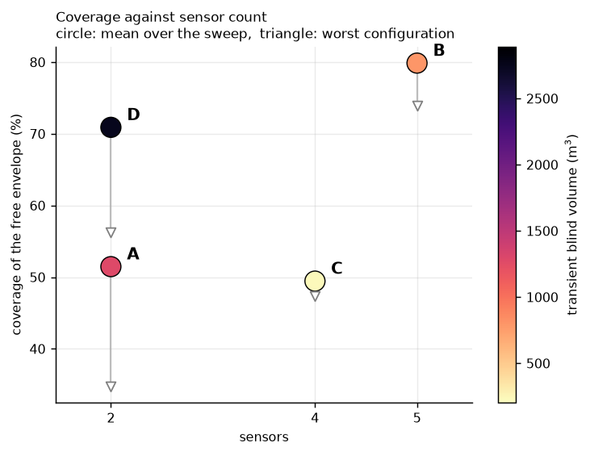
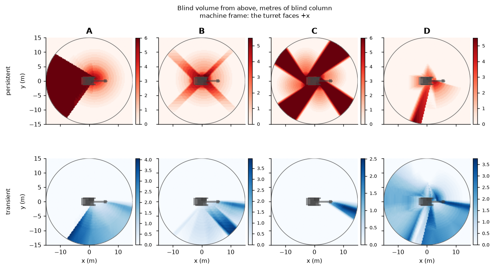
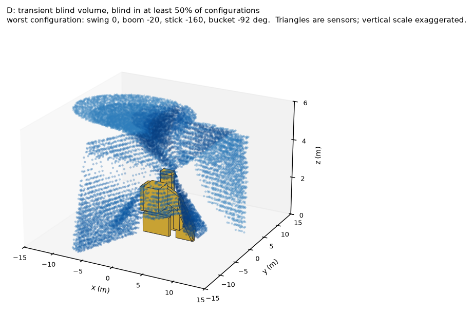
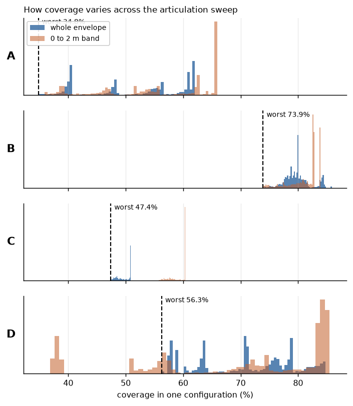
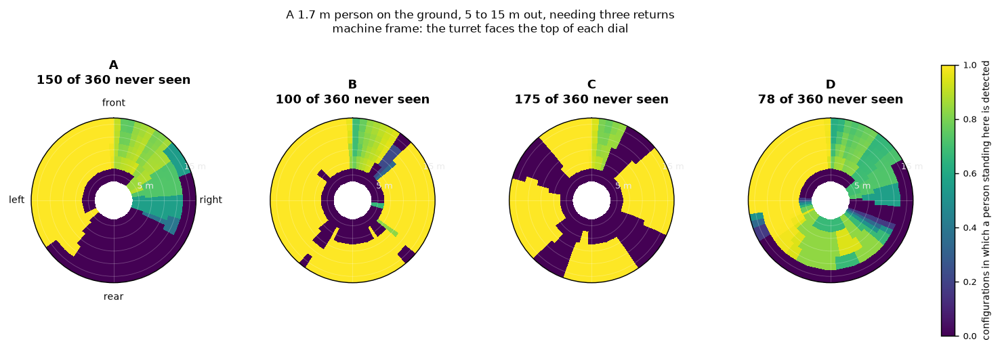
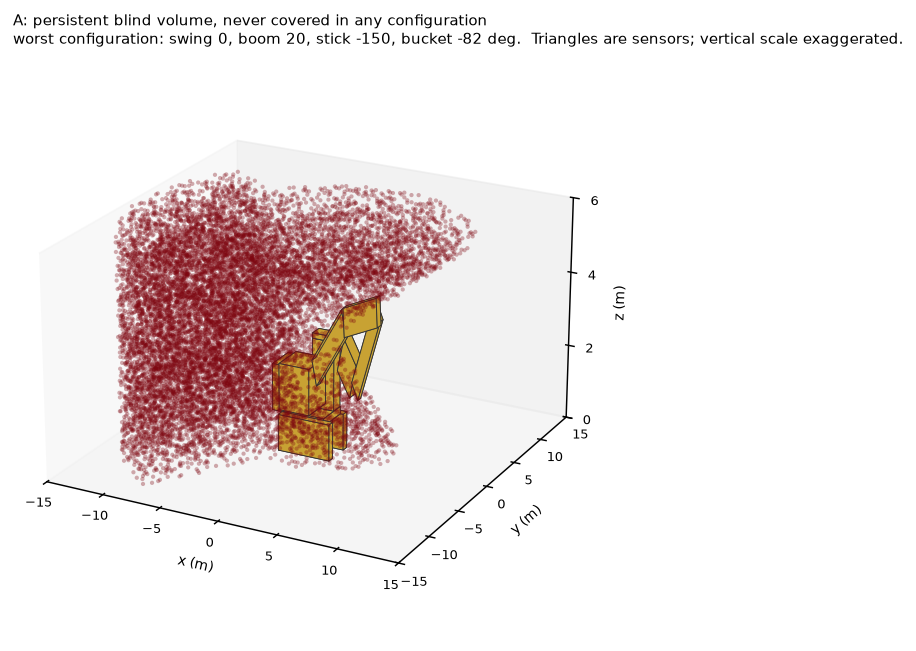
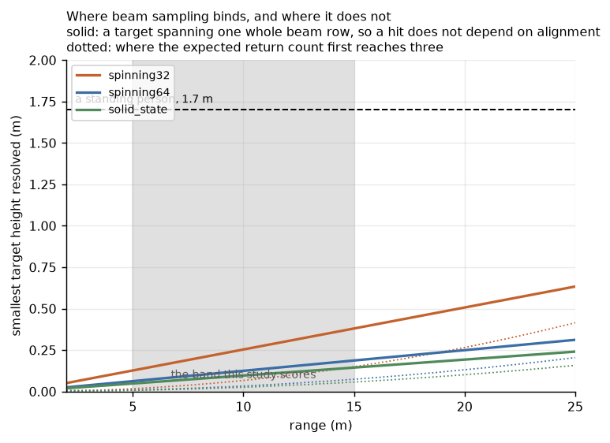

# Sensor coverage for an articulated excavator

Where should the perception sensors go on a 20 tonne hydraulic excavator, and
what does each arrangement actually buy?

The usual way to answer this is to park the machine, pick a representative pose,
cast rays, and report a coverage percentage. That analysis is misleading on this
class of machine, and not by a little. The largest occluder on an excavator is
also its working member: the boom, stick and bucket sweep bodily through the
region the sensors are supposed to watch. A blind spot found that way is a blind
spot at one configuration. It says nothing about whether the region is still
covered when the boom comes down.

So this study sweeps the joint space instead, and splits the blind volume in two:

- **Persistent** blind volume is never covered in any configuration. It is a
  placement flaw, and the fix is to move or add a sensor.
- **Transient** blind volume is covered in some configurations and not others.

The transient class is the interesting one, and it is the more dangerous of the
two for a reason that has nothing to do with how big it is. A persistent blind
spot is discoverable. Anyone who runs a static coverage
analysis, or walks around the machine once with a test target, will find it, and
it can be trained and designed around. A transient one is covered when you look
and blind when the boom comes down. It is invisible to exactly the analysis most
people run, and it teaches operators to trust a region that is not always there.

## Result

Four layouts, 34,368 configurations each, 271,296 cells of work envelope.

| Layout | Sensors | Coverage | Worst pose | Person band | Dual | Persistent | Transient | Detected | Never seen |
|---|---|---|---|---|---|---|---|---|---|
| A | 2 | 51.5% | 34.8% | 55.8% | 32.0% | 1605 m3 | 1275 m3 | 51.0% | 150 |
| B * | 5 | 79.9% | 73.9% | 81.2% | 29.8% | 564 m3 | 795 m3 | 69.3% | 100 |
| C | 4 | 49.4% | 47.4% | 59.1% | 0.0% | 2081 m3 | 228 m3 | 50.7% | 175 |
| D * | 2 | 70.9% | 56.3% | 69.6% | 17.4% | 325 m3 | 2751 m3 | 64.1% | 78 |

`*` on the Pareto front over coverage up and sensor count down. "Never seen" is
how many of the 360 candidate standing positions are never detected in any
configuration the machine can reach.



### The boom mount works, and the mean is the wrong way to read it

D and A carry the same two spinning lidars. The only difference is where the
second one goes, and it is worth 19 points of coverage: 70.9 percent against
51.5. More striking is the persistent blind volume, which is the quantity a
placement is really responsible for. D leaves 325 m3 of the envelope permanently
unseen. A leaves 1605 m3, five times as much, and B leaves 564 m3 with five
sensors and two modalities. On the metric that measures whether a sensor
arrangement has a hole in it, two sensors with one on the boom beat five sensors
bolted to the house.

That is the case for the boom mount, and it is a real one. The rest of the
result is the bill.





D converts its persistent blind volume into transient blind volume rather than
eliminating it. The shape above is the half of it that is blind in most
configurations rather than a few: a shell over the machine where both sensors'
vertical windows run out, and a skirt at ground level that the boom unit sweeps
in and out of as it works. 2751 m3 of the envelope is covered in some configurations and
not others, three and a half times B's 795 m3, and the effect concentrates
exactly where it should not: in the 0 to 2 m band where a person stands, 61.9
percent of the free volume is transient for D against 12.3 percent for B.

So the mean flatters it. Read the worst configuration instead and the ordering
reverses:

| | mean coverage | worst pose | person band, worst | detection, worst pose |
|---|---|---|---|---|
| B, five sensors | 79.9% | 73.9% | 73.8% | 62.5% |
| D, two sensors | 70.9% | 56.3% | **36.8%** | **33.3%** |

B gives up 6 points between its average and its worst case. D gives up 15, and
in the person band it gives up 33: at its worst configuration, barely a third of
the ground-level volume around the machine is covered, and two thirds of the
places a person could be standing are undetectable. B never drops below 62
percent on that measure.



### Where each layout's hole is



A's failure is structural and the map shows it in one look. The cab on an
excavator is offset to the left and the boom sits hard against its right face,
1 cm away in this model. There is nowhere to put a sensor outboard of the cab on
the boom side, so "two lidars at the cab front corners" means a 0.8 m baseline
entirely on the left of the machine, and the whole right rear quadrant is never
covered in any configuration. 150 of 360 standing positions are never detected.



C is the most stable layout in the study, varying only 3.5 points across the
entire sweep, because its corner units are aimed outward and barely see the boom
at all. It is stable and poor. Four windows of 70 degrees total 280, so 80
degrees of azimuth is unavailable before anything else is considered, and the
corners make it worse because a unit 1.5 m off the centreline spans less
machine-frame bearing than its own field of view. The best aiming found leaves
38 percent of bearings uncovered and, more damningly, **zero dual coverage
anywhere**: any overlap has to be bought from a window budget that is already
short of the circle. C is the only layout here with no redundancy at all.

B is the least interesting and the most defensible. Five sensors, no drama, and
the flattest worst case of the four.

### What D costs, said plainly

D wins on coverage per sensor and it wins on persistent blind volume. It should
still not be chosen on this evidence alone, and the reasons do not appear
anywhere in the table.

Its extrinsic is a function of joint state. A cab-mounted sensor is calibrated
once at build and stays calibrated until something hits it. The boom unit's pose
has to be computed from the boom and stick encoders every frame, so every
forward-kinematics error, every millimetre of pin wear, and every bit of boom
flex under load lands directly in the point cloud as a pose error. None of that
is modelled here: this study assumes the boom sensor's pose is known exactly,
which is precisely the assumption that fails in service.

It needs joint state time-synchronised to the lidar clock. The boom moves
through most of a working cycle, and a cloud assembled from a moving sensor with
a stale joint angle smears.

It is also the only sensor in the study that ever drops below the top of the
tracks. At full boom-down the boom unit sits at 0.71 m against a 0.98 m track,
and the undercarriage, which does not swing with the house, starts occluding it.
That is the one place in the whole study where swing angle changes the answer.

And the failure modes compound. D's advantage is that a moving viewpoint fills
in what a fixed one cannot, which only holds while you know where the viewpoint
is. Its weakness is that its coverage is already the least consistent of the
four. Calibration drift degrades exactly the configurations that are already
worst, which is the opposite of the property you want from a safety-relevant
sensor.

The defensible reading of the front is that B is the safe answer and D is the
interesting one: if the calibration problem is solved properly, with encoders
good enough and synchronisation tight enough to trust, D delivers most of B's
coverage and less permanent blind volume for two sensors instead of five. If it
is not solved, D is a layout whose worst case is twice as bad as B's and whose
error budget is unbounded.

### The safety metric does not bind, and that is worth knowing

The brief asks whether a 1.7 m by 0.4 m cylinder can be hit by at least three
rays from 5 m out. Inside this envelope that threshold is never the binding
constraint. At 15 m, the worst case in the band, that target still spans about
4 beam rows and 8 azimuth columns on the coarsest sensor modelled, so it comes
back with roughly 34 returns. Every "not detected" in this study is an occlusion
result, not a sampling one.

That is worth stating rather than reporting a criterion that is satisfied
everywhere it is not blocked. Sampling does bind, just not on people:



A target has to span a whole beam row before a hit stops depending on where it
happens to be standing relative to the beam pattern. On the 32 channel unit that
is 0.38 m at 15 m and 0.25 m at 10 m. A standing person clears it everywhere. A
kerb, a survey peg, a crouching worker, or anything else under about 0.4 m does
not, beyond roughly 16 m, and for those targets the beam count is the whole
question. That is a different study, and it would want the 64 channel unit.

## Running it

```bash
pip install -e ".[raycast,dev]"
```

```bash
python -m pytest -q
```

A single layout, at the coarse preset, to check the pipeline end to end in about
a minute:

```bash
python -m sensorcov.run_sweep --layout d_cab_and_boom --quick
```

The full study, all four layouts. About twenty minutes per layout across twelve
worker processes, so an hour and a half in total; each sweep is cached as
`results/<layout>.npz` and reused, so re-running only recomputes what changed:

```bash
python -m sensorcov.study --workers 12
```

```bash
python -m sensorcov.run_figures
```

## Method

### The machine

A Cat 320 GC, built from primitives rather than a production URDF. Occlusion is
driven by gross volume rather than surface detail, and a dozen boxes build their
bounding hierarchy in under a millisecond, which is what makes a thirty thousand
pose sweep finish at all.

Link lengths, cab height, tail swing radius, track gauge and counterweight
clearance are read off the manufacturer's technical specification, and
`configs/machine/cat320.yaml` keeps measured and inferred numbers in separate
blocks so the distinction survives into the results. The solids are derived from
those numbers rather than typed in beside them, so correcting a dimension moves
the geometry with it.

The one shape detail that is not optional is the gooseneck. A real excavator
boom bends, and since boom shadow is the entire subject of the study, modelling
it as one straight box would put the shadow in the wrong place.

The boom foot position and the joint limits are not published, so they are
fitted against the three published working ranges instead. The chain reproduces
a 9.86 m maximum reach at ground line, a 6.72 m digging depth and a 9.45 m
cutting height to within 7 cm, and a test asserts it. That check is the main
reason to believe the kinematics: it compares against the manufacturer rather
than against ourselves, and a sign error anywhere in the chain breaks it.

### Two ray models, kept apart

This is the design decision the rest of the study rests on.

**Line of sight** asks whether a sensor could see into a region at all: in
range, inside the field of view, unoccluded. It ignores angular sampling, which
is the right abstraction for a coverage percentage.

**Beam accurate** generates the discrete rays the device really emits. A 32
channel lidar spread over 45 degrees of elevation leaves about 1.4 degrees
between channels, which at 15 m is a 38 cm vertical gap, wider than the 25 cm
cells the envelope is cut into. Targets genuinely fall between beams.

Conflating the two would quietly destroy the safety metric. Scored against a
solid field-of-view cone, every target in range is struck by infinitely many
rays, so "hit by at least three beams" reads 100 percent everywhere and means
nothing. Cameras are not pretended into the beam model at all; they are scored
on pixels on target, which is what actually limits a camera on a small obstacle
at range.

### The frame the numbers are in

Coverage is measured in a machine frame: the world with the swing angle taken
out, so `+x` is whichever way the upper structure is currently facing.

This is not a presentational choice. Measured in the world instead, a
turret-mounted sensor sweeps past every fixed cell as the machine slews, so
almost every cell is seen in some configurations and missed in others. The first
version of this study did exactly that and reported 94 percent of the envelope
as transient with nothing at all always seen, for every layout, which is a true
statement about excavators slewing and tells you nothing about where to put a
sensor. In the machine frame the swing drops out for anything bolted to the
turret and what is left is the articulation effect the study is about.

Swing still earns its place in the sweep, because the undercarriage does not
turn with the house. That turns out to matter exactly once: the tracks never
occlude a cab-mounted sensor, which looks down over them from 3 m, and only bite
on layout D's boom unit at full boom-down, where it drops to 0.71 m against a
0.98 m track.

### Occupied is not blind

The boom sweeps through the work envelope, so the cells it currently fills are
solid, not unseen. Counting them as blind would report an enormous transient
volume that is really just the boom being where the boom is, and it would be the
headline number. Occupancy is recomputed per pose and excluded from the
denominator.

It is computed analytically from the primitives rather than with Open3D's
`compute_occupancy`, which counts ray crossings: the machine is built from
deliberately overlapping boxes, and a point inside two of them crosses an even
number of surfaces and comes back empty.

### The sweep

Swing every 15 degrees, boom, stick and bucket every 10, which is 71,136
configurations before filtering. Poses that drive the bucket below grade are
dropped, because the ground here is an unbroken flat plane with no trench cut
into it, and poses that fold a link into the cab are dropped as unreachable. The
rejection counts are reported so the denominator is auditable.

Storing visibility per pose per cell is not possible, so nothing is. Four
counters per cell are enough to recover everything: how many poses the cell was
free in, how many it was seen in, how many it was seen by two or more sensors
in, and whether it was ever seen at all.

## Layout

```
sensorcov/
  frames.py       frame conventions and SE(3) helpers; the single source of truth
  machine.py      the Cat 320 as primitive solids, derived from the spec numbers
  kinematics.py   the four joint chain, working ranges, and the pose grid
  sensors.py      sensor families, beam tables, field of view, and mounts
  envelope.py     the voxelised work envelope and its bookkeeping
  raycast.py      Open3D scene assembly, line of sight, and occupancy
  detect.py       beam-accurate detection of a standing person
  sweep.py        the articulation sweep and its per-cell counters
  metrics.py      persistent and transient split, volumes, Pareto front
  study.py        the four layouts and the trade study
  viz.py          figures
configs/
  machine/        the spec sheet, split by provenance
  sensors/        the four sensor families, parameterised
  layouts/        the four candidate arrangements, with their rationale
tests/sensorcov/  mirrors the package
```

## Caveats

What this does not show.

The geometry is primitive. Boxes and a two-segment boom stand in for real hulls,
which is the right abstraction for gross occlusion and the wrong one for
anything at the scale of a handrail or a mirror. Cab glazing is modelled as
solid, so a sensor inside the cab would be scored as blind; none of these
layouts put one there.

The ground is a flat, unbroken plane. There is no trench, no spoil pile, no
slope and no bench. An excavator spends its life next to all four, and each of
them both occludes and creates the hazard that matters. Poses that put the
bucket below grade are excluded for this reason rather than because the machine
cannot reach them.

There is no detector in the loop. A target is "detected" when the geometry says
enough beams come back off it, at any range within the band and at any incidence.
Real perception fails on reflectivity, on rain and dust, on motion blur, and on
targets that are geometrically visible and statistically indistinguishable from
the spoil behind them. Every number here is an upper bound.

Sensors are treated as ideal and always working. No occlusion by their own
mounts beyond the machine geometry, no fouling, no calibration error. That last
one matters unevenly across the layouts, and the trade study says so in words
rather than pretending a scalar carries it.

The aiming within each layout was chosen to be reasonable, not optimised. Layout
C in particular is sensitive to it: four 70 degree windows cannot cover 360, and
where the missing 80 degrees is put changes its coverage by tens of points. The
study prices four named arrangements; it does not search the space of mounts.

Finally, the transient and persistent split is relative to the pose grid. A
configuration the grid does not visit cannot contribute a blind spot, and a
blind spot that exists only between grid points is invisible. The grid is the
one the brief specifies; a finer one would only ever find more.
